# 🚀Windows Server VM in Azure - Secure Web Server Project

## 📌 Overview
This project demonstrates how to deploy and configure a Windows Server 2025 Virtual Machine in Microsoft Azure and use it as a basic web server.
The goal was to learn the fundamentals of cloud infrastructure, networking, server configuration, and basic security practices.

## ⚙️ Architecture
- Windows Server 2025 VM
- IIS Web Server
- Network Security Group (NSG)
- Public IP for web access
- SSL (HTTPS)
- Snapshot (backup)
- Basic monitoring (CPU, Network, Event Logs)

## Steps

### 🖥️ 1. Virtual Machine Creation
- Created Windows Server 2025 VM in Azure
- Configured basic settings (region, size, credentials)
- **Purpose:** To deploy a functional server accessible from the internet
- 📸 Screenshot: 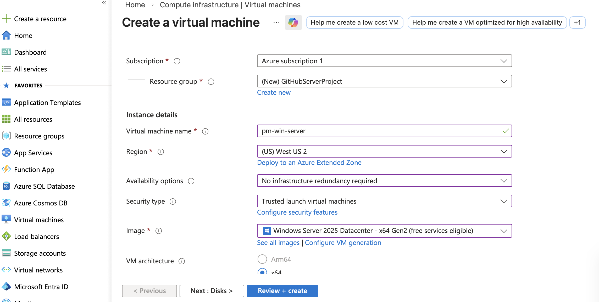

### 🔒 2. Network Security Configuration (NSG)
- RDP (port 3389) restricted to my IP only
- HTTP (port 80) allowed publicly
- Other traffic blocked
- **Purpose:** To secure remote access while allowing public web traffic
- 📸 Screenshot: 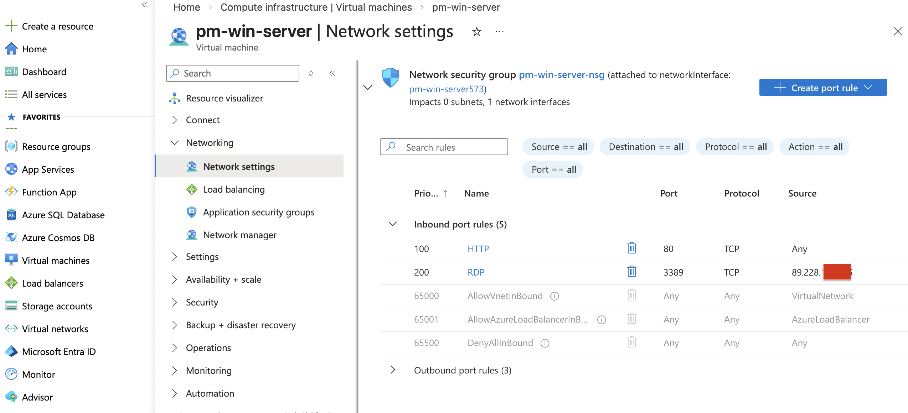

### 💻 3. Remote Connection (RDP)
- Connected to the VM using Remote Desktop Protocol
- Verified successful login and access to Windows Server
- **Purpose** To manage and configure the server remotely.
- 📸 Screenshots: 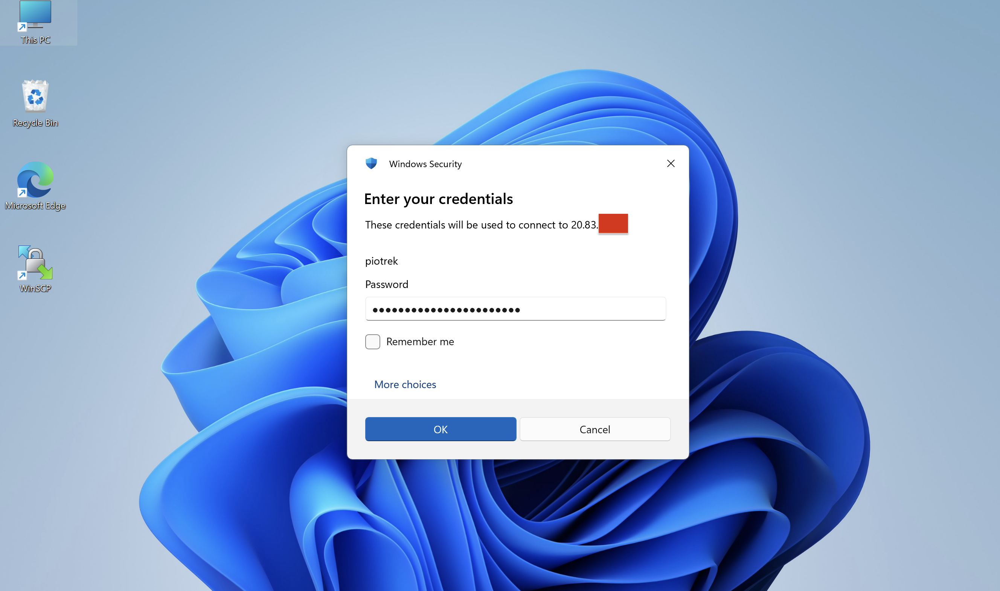
  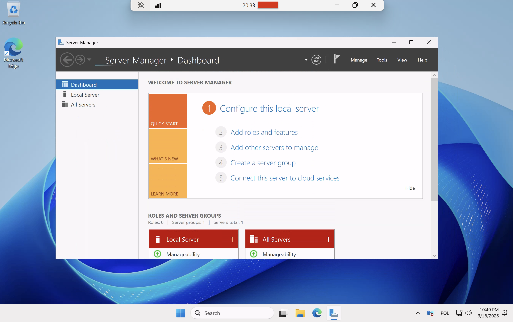

### 🏗️ 4. IIS Installation
- Opened Server Manager
- Installed Web Server (IIS) role
- Verified default IIS page using localhost
- **Purpose** To configure the VM as a web server.
- 📸 Screenshots: 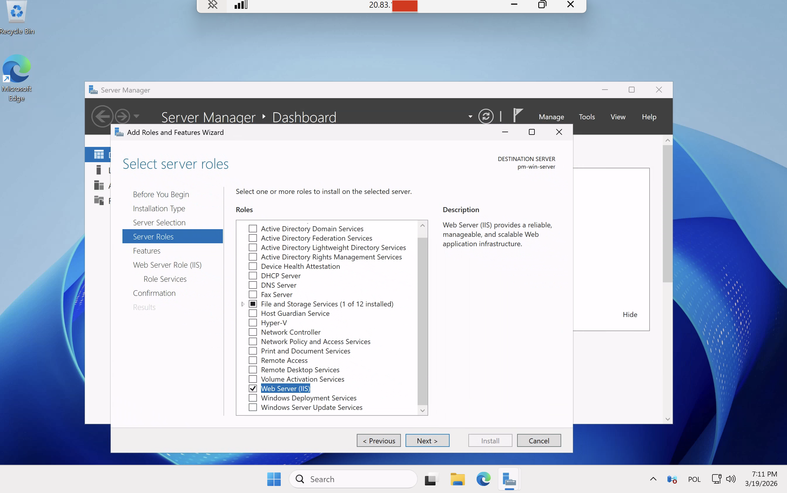
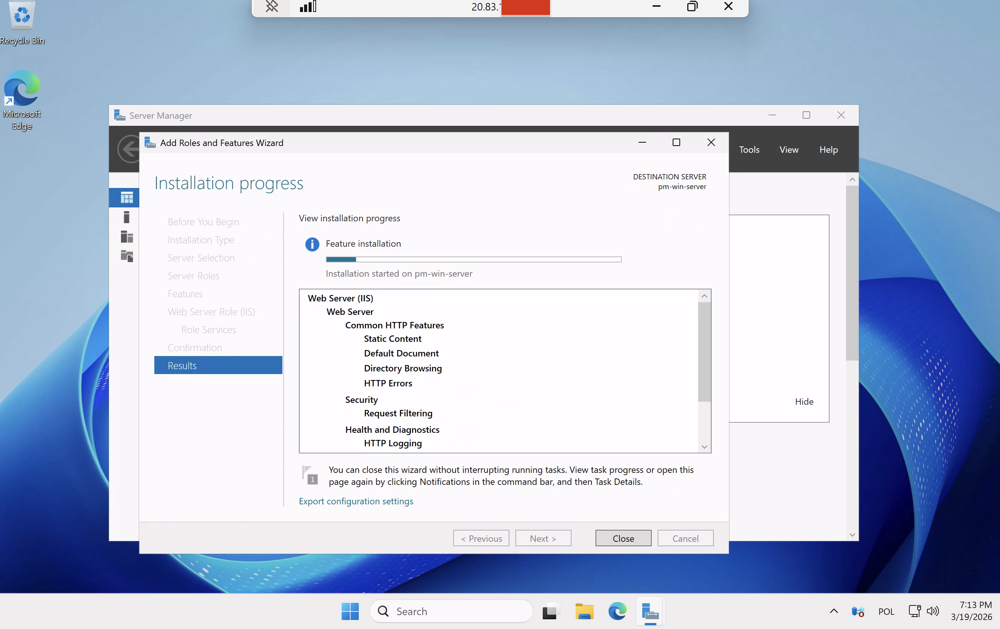
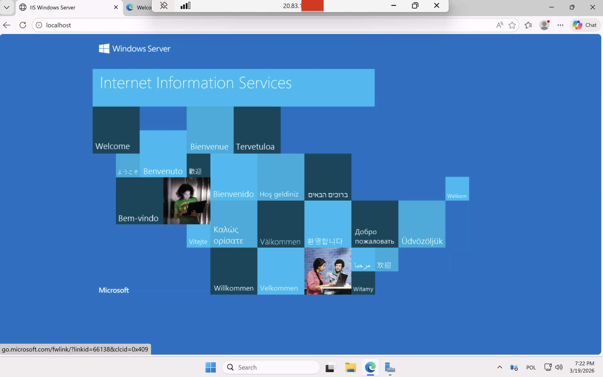

### 🎨 5. Custom Web Page Deployment
- Navigated to the IIS web root folder: `C:\inetpub\wwwroot`
- Created a simple HTML page with dark theme styling:
- Saved it as index.html
- Verified the page in a browser using http://localhost
- **Purpose** To test web hosting functionality and verify that HTTP access is working.
This step also demonstrates basic server deployment and file management in IIS.
- 📸 Screenshots: 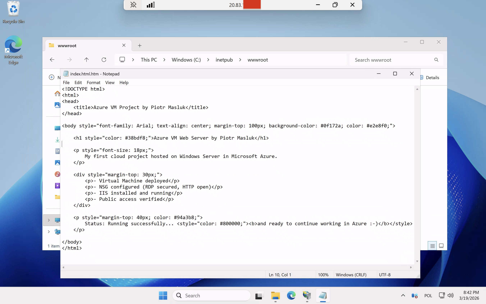
  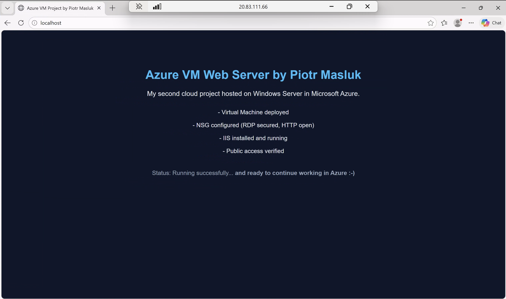

### 🌐 6. Public Access Verification

- Accessed the web server using the VM's public IP address
- Verified that the custom HTML page deployed in step 5 is visible
- Ensured NSG and firewall rules allow HTTP (port 80)
- **Purpose:** To confirm that the server is accessible from the internet and that network rules are configured correctly.
- 📸 Screenshot: 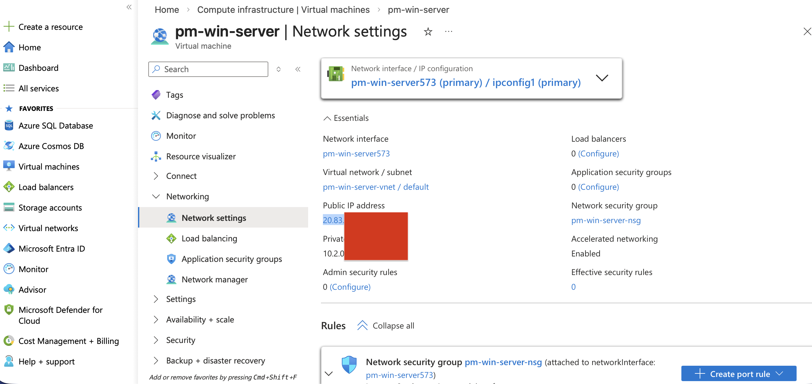
  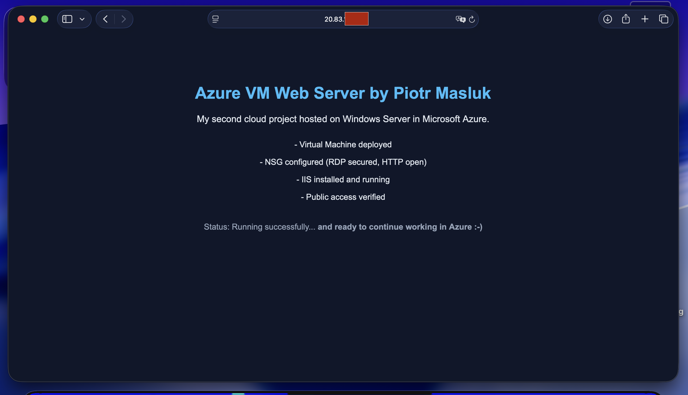

### 🛠️ 6.1 Enable HTTPS

- Added HTTPS binding in IIS using a self-signed certificate
- Verified access: https://<public-IP from VM Azure Portal --> 20.83.**.**)
- Page loads securely with SSL
- **Purpose** Demonstrates basic web security practice and HTTPS configuration in Azure/IIS.
- 📸 Screenshot: 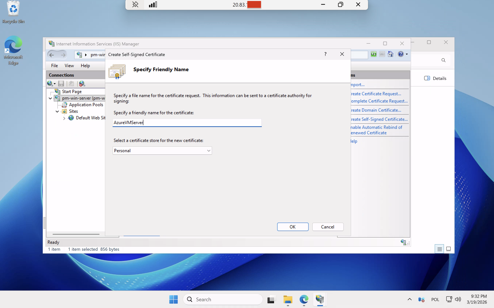
  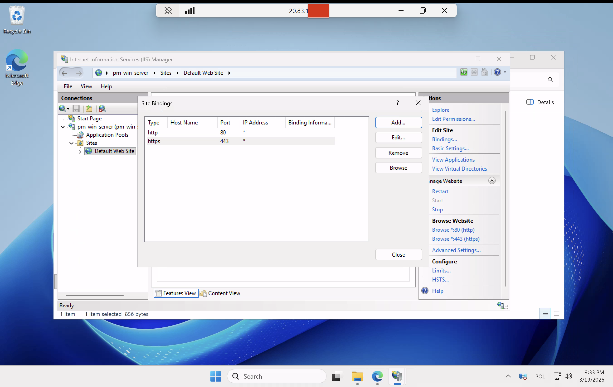
  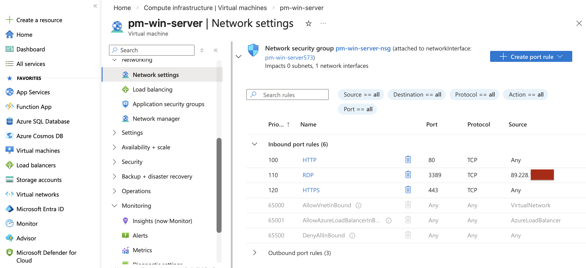

### 💾 7. Backup / Snapshot

- Created a snapshot of the Windows Server VM
- Snapshot allows restoring VM to a previous state if needed
- **Purpose** Demonstrates basic backup and recovery practices in Microsoft Azure.
- 📸 Screenshot: 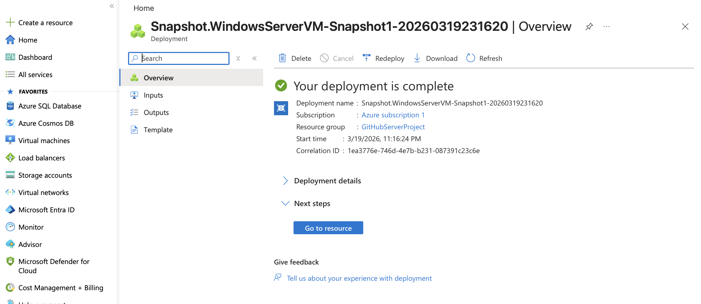

### 📊 8. Monitoring and Logs

- Checked VM performance metrics in Azure (CPU, Memory, Network)  
- Reviewed Windows Event Viewer logs (System, Application, Security)
- **Purpose** To learn basic monitoring and troubleshooting techniques in a cloud environment.
- 📸 Screenshot: 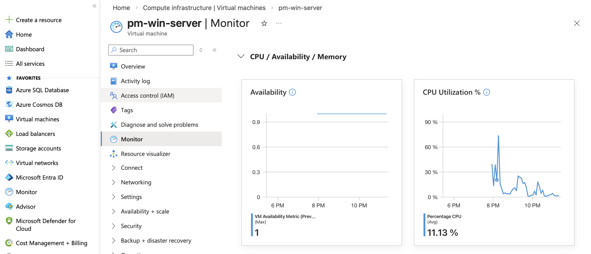
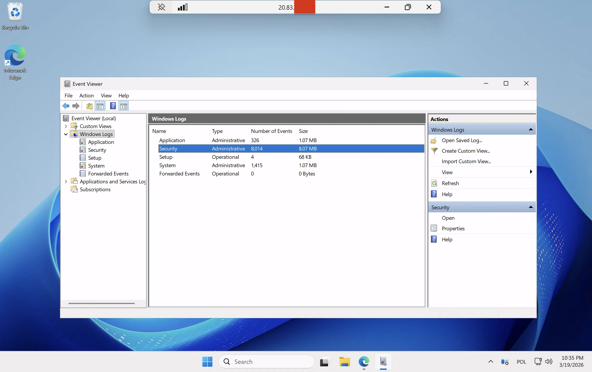

## ❗Troubleshooting

### Issue (1): RDP login failed (account locked / password issue)

While connecting to the VM via RDP, I encountered a login issue caused by an incorrect password and account lockout.

#### Solution:
- Reset the password using Azure Portal
- Used Azure CLI to unlock the user account

#### Result:
Successfully restored access to the VM and verified RDP connectivity.

---

### Issue (2): Page not displaying after HTML update

After updating 'index.html` in `C:\inetpub\wwwroot`, the page showed "403 Forbidden" and did not load correctly in the browser.

#### Solution:
- Open IIS Manager as Administrator
- Navigate to your site (Default Web Site)
- Enable **Directory Browsing** in the **Actions / Feature View** panel
- Ensure the **Default Document** includes `index.html`
- Restart the website
- Refresh the browser (Ctrl+F5)

#### Result: Page loaded successfully and changes were visible.

## 💡 What I learned
- Azure Virtual Machine deployment
- Network Security Group (NSG) configuration
- Remote server management (RDP)
- IIS installation and web hosting basics
- Basic HTTPS / SSL configuration
- Snapshot and backup
- Monitoring and log review
- Troubleshooting real-world issues
- Cloud security practices
